# 계좌 관리 어시스턴트 생성하기
## Action 생성하기
### 1. Action명 작성하기
**New Action**를 선택하고 액션 이름을 지정합니다.  
   - 액션명 : 
      ```
      새 당좌 예금 계좌를 개설하고 싶습니다
      ```
### 2. Action 인식 문구(Phrases) 작성하기
**Customer starts with**를 선택합니다. Action 트리거 문구를 작성하는 창입니다. 사용자가 입력한 문구가 Action을 인식하는지 테스트 한후 인식하지 못하는 문구를 추가로 입력하여 사용자의 문구를 이해하는 훈련을 진행합니다.   
    - ```Preview```버튼을 클릭합니다.   
           
    -  채팅창에 아래 문구를 입력합니다.    
         ```
         계좌 개설
         ```
            
    -  ```No matche``` 경고가 나옵니다. Assistant가 사용자가 입력한 문구를 이해하지 못하기 때문입니다.   
      debug 버튼을 클릭하여 문구 입력의 이해를 확인해 봅니다.     
        
    -  ```계좌개설``` 에 대한 이해가 ```6%``` 밖에 되지 않습니다.    
      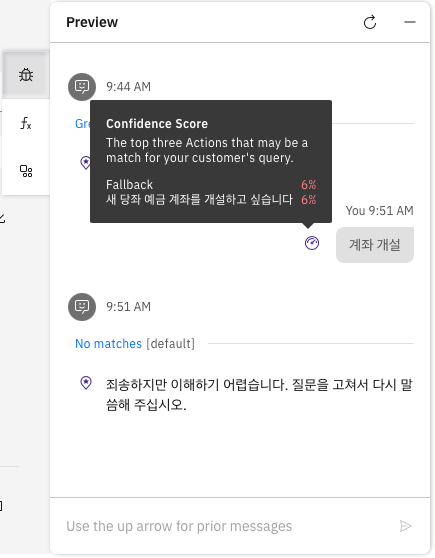  
    -  ```Add example phrases:```에 ```계좌 개설``` 문구를 넣고 엔터를 누릅니다.    
        
    -  새로운 문구가 Action을 트리거 할 수 있도록 훈련이 진행됩니다.   
        
    -  훈련이 완료되면, 다시 채팅창에 ```계좌개설``` 문구를 삽입합니다. 액션을 잘 인식하고 트리거를 수행합니다.   
      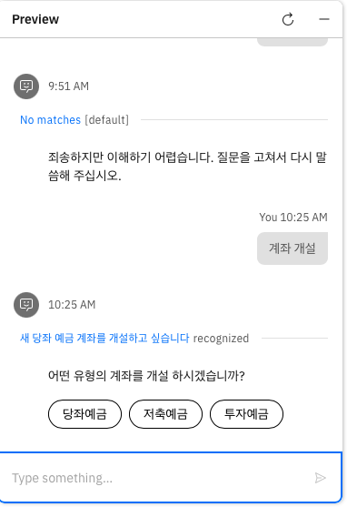  
    -  ```계좌개설``` 에 대한 이해가 ```100%``` 임을 확인할 수 있습니다.   
        
    -  각 문구의 길이는 최대 1,024자입니다. 이러한 문구를 추가하면 AI 비서가 고객이 원하는 바에 맞는 적절한 행동을 학습합니다. 추가된 예시는 AI 비서의 머신러닝 엔진이 자연어 처리 모델을 생성하는 데 사용하는 학습 데이터를 구축합니다. 이 모델은 고객이 고유하게 정의한 행동을 이해하도록 맞춤 설정됩니다.   
      [사용자의 질문이나 요청 이해하기 문서](https://www.ibm.com/docs/en/watsonx/watson-orchestrate/base?topic=actions-understanding-your-users-questions-requests)

## Setp 생성하기
### 1. 첫번째 스텝 작성하기 
**New Sept** 버튼을 클릭하여 스텝을 추가합니다.   
   이제 계좌 개설 상호작용의 첫 단계를 만들 차례입니다. 먼저 고객이 원하는 계좌 유형에 대한 질문부터 시작해 보겠습니다.
   - **Assistant says**  
     ```
      어떤 유형의 계좌를 개설 하시겠습니까?
     ```
      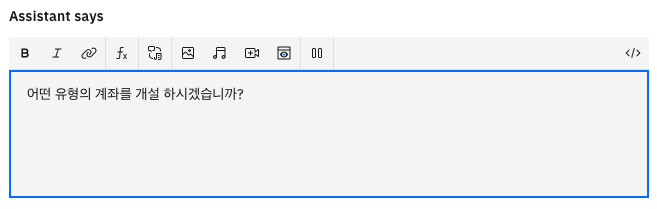
   - **Define customer response > Options** 을 선택합니다.   
      팝업창에서 Option을 당죄예금, 저축예금, 투자예금 3개를 추가 합니다.
      

   - **Preview** 버튼을 클릭하여 동작을 확인 합니다.   
      ```
      새 계좌를 개설할 수 있나요?
      ```
      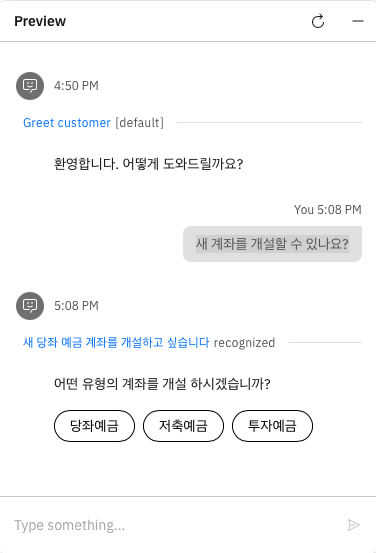

   첫번째 스텝을 완료 하였습니다.

### 2. 두번째 스텝 작성하기
**New Sept** 버튼을 클릭하여 두번째 스텝을 추가합니다.   
   이제 계좌 개설 상호작용의 두번째 단계를 만들 차례입니다. 먼저 고객이 선택한 계좌 유형에서 ```투자예금```의 경우 다른 조건으로 처리하는 스텝을 만듭니다. 투자예금의 경우 고객으로 부터 ```투자 번호```를 입력 받아야 합니다. 이 과정을 만들어 보겠습니다.
   - **with conditions** 을 선택합니다.     
      - 1번 ```어떤 유형의 계좌를 개설 하시겠습니까?``` 스텝에서 사용자가 투자예금의 선택한 조건을 작성합니다.   
      if 조건에서 ```Action step variables``` 를 선택합니다.   
          
      - ```1.어떤 유형의 계좌를 개설 하시겠습니까?``` 을 선택합니다.   
      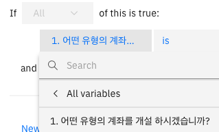   
      - is 다음의 조건을 클릭하여 ```투자예금```을 선택합니다.   
      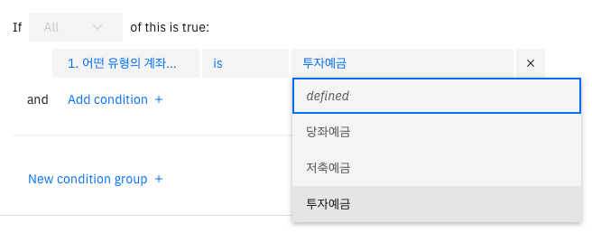   
      - 첫번째 스텝에서 사용자가 선택한 투자예금 조건에 대해 설정을 완료 하였습니다.
         
   - **Assistant says**  
     ```
      당신의 투자 번호가 무엇입니까?
     ```
      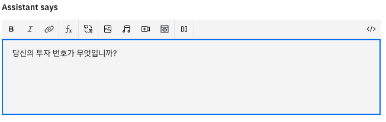   
   - **Define customer response > Number** 을 선택합니다.   
      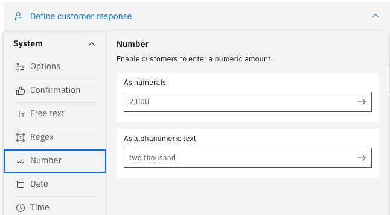   
      사용자로 부터 투자번호를 입력 받기 위한 작업을 진행 합니다.   
       
   - **Preview** 버튼을 클릭하여 동작을 확인 합니다.   
       

   두번째 스텝을 완료 하였습니다.

### 3. 세번째 스텝 작성하기
 **New Sept** 버튼을 클릭하여 세번째 스텝을 추가합니다.   
   이제 계좌 개설 상호작용의 세번째 단계를 만들 차례입니다. 먼저 고객이 선택한 계좌 유형에서 ```투자예금```의 경우 고객으로 부터 ```투자 번호```를 입력 받습니다. 이 조건을 만족하면 상담원과 연결하는 과정을 만들어 보겠습니다.
   - **with conditions** 을 선택합니다.     
      - 1번 ```어떤 유형의 계좌를 개설 하시겠습니까?``` 스텝에서 사용자가 투자예금의 선택한 조건을 작성합니다.   
      if 조건에서 ```Action step variables``` 를 선택합니다.   
          
      - ```1.어떤 유형의 계좌를 개설 하시겠습니까?``` 을 선택합니다.   
         
      - is 다음의 조건을 클릭하여 ```투자예금```을 선택합니다.   
         
      - Add condition + 버튼을 클릭하여 두번째 조건을 넣습니다.    
      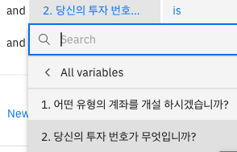   

      - 첫번째 스텝에서 사용자가 선택한 투자예금 조건에 대해 설정을 완료 하였습니다.
      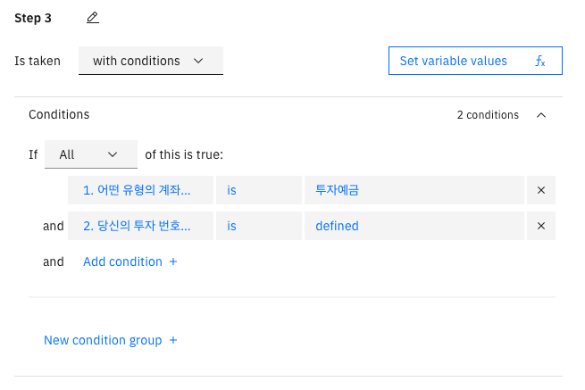   

   - **Assistant says**  
     ```
      귀하를 위해 새로운 투자 계좌를 개설할 수 있는 에이 전트에게 연결해 드리 겠습니다!
     ```
          

   - **And then > Continue to next step > Connect to agent** 을 선택합니다.   
      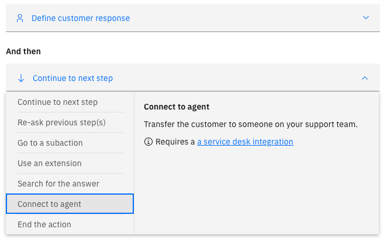    
      - default로 하고 Apply(적용) 클릭하여 설정을 합니다.   
         
      - 에이전트에 보낼 메시지를 작성합니다. 아래 문구를 ```Message to agent(Optional)``` 에 입력합니다.   
         ```
         고객이 원하는 투자 번호는
         ```
         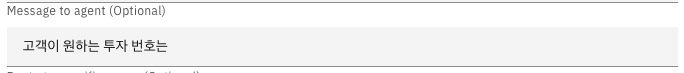  
      - 고객으로 부터 받은 투자 번호를 전달하기 위해 설정합니다. ```$``` 문구를 통해 변수를 선택합니다.   
      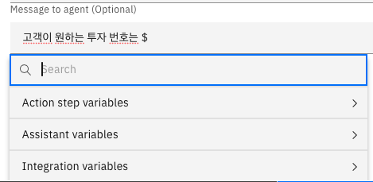  
      - ```Actions step variables > 2.당신의 투자 번호가 무엇입니까?```를 선택하여 사용자로 부터 입력받은 ```투자번호```를 전달합니다.   
      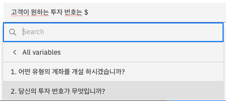  
      - 나머지 ```입니다``` 문구를 넣어 문장을 완성합니다.      
      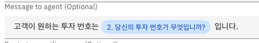  
      - [Connecting to a live agent 문서](https://cloud.ibm.com/docs/watson-assistant?topic=watson-assistant-human-agent)에서 상세한 내용을 확인할 수 있습니다.   
      - Agent에 연결하는 설정을 완료 하였습니다.
      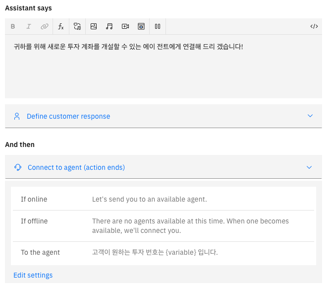 

   - **Preview** 버튼을 클릭하여 동작을 확인 합니다.      
      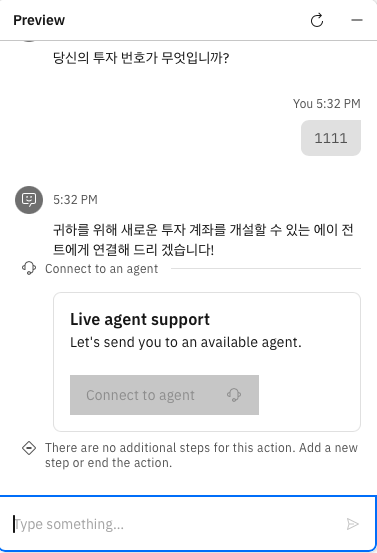      
   세번째 스텝을 완료 하였습니다.  

### 4. 네번째 스텝 작성하기
 **New Sept** 버튼을 클릭하여 네번째 스텝을 추가합니다.   
   이제 계좌 개설 상호작용의 네번째 단계를 만들 차례입니다. 고객이 선택한 계좌 유형에서 ```당좌예금``` 또는 ```저축예금``` 의 경우 포탈 시스템으로 안내하는 과정입니다.   
   - **with conditions** 을 선택합니다.     
      - 1번 ```어떤 유형의 계좌를 개설 하시겠습니까?``` 스텝에서 사용자가 투자예금의 선택한 조건을 작성합니다.   
      if 조건에서 ```Action step variables``` 를 선택합니다.   
          
      - ```1.어떤 유형의 계좌를 개설 하시겠습니까?``` 을 선택합니다.   
         
      - ```is any of``` 조건 유형을 선택합니다.   
      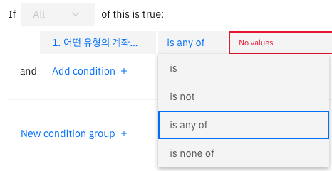   
      - 조건 값  ```당좌예금``` 과 ```저축예금```을 선택 합니다.    
      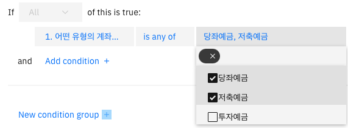   
      - 첫번째 스텝에서 사용자가 선택한 ```당좌예금``` 또는 ```저축예금``` 의 경우 처리하는 조건에 대해 설정을 완료 하였습니다.
      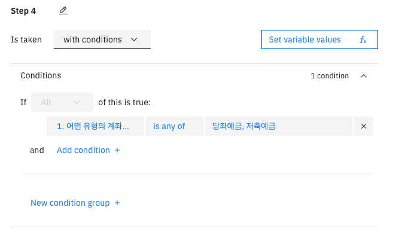   

   - **Assistant says**  사용자로 부터 입력 받은 변수를 Assistant가 말하도록 설정합니다.   
     - 화면에서 ```fx```버튼을 클릭합니다. 팝업창에서 ```Action step variables```을 선택합니다. 조건 작성시 사용하는 방법과 동일합니다.     
     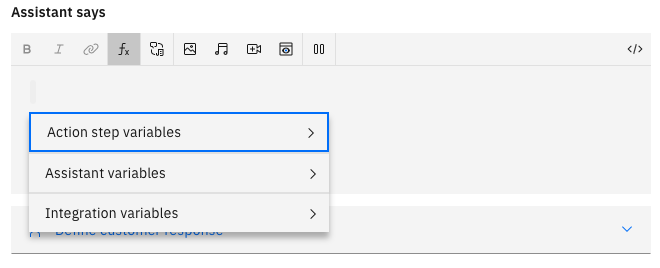  
     - 첫번째 스텝```어떤 유형의 계좌를 개설 하시겠습니까?```을 선택합니다.   
       
     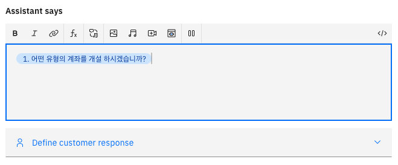  
     - 추가 메시지 ```계좌 개설을 위해```을 텍스트 상자에 입력합니다.   
     ```
      계좌 개설을 위해  
     ```
     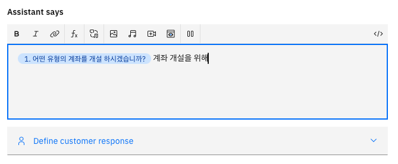  
     - 포털 주소 링크를 삽입합니다. 링크 아이콘을 클릭합니다.  
        
     - 포털 시스템의 계좌 개설 주소를 입력합니다. 예를 들어
         ```
         www.ibm-bank.com/open‑a‑new‑account?account_type=
         ```
         와 같이 실제 사용하는 url 정보를 입력합니다.    
         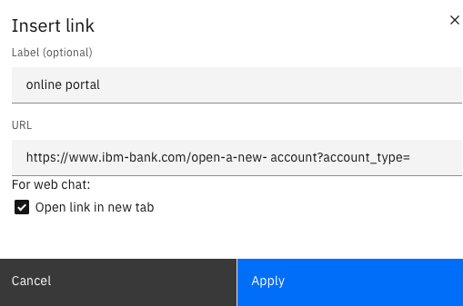     
     - 이때 ```$``` 를 통해 변수 값을 전달 할 수 있습니다. ```$``` 를 입력하면 스텝에서 사용자로 부터 받은 변수값을 선택하는 창이 활성화 됩니다.   
          
     ```Action step variables > 1.어떤 유형의 계좌를 개설 하시겠습니까?``` 을 선택 합니다.     
         
     - apply를 클릭하여 설정을 적용합니다.     
          
     - 추가 메시지 ```에 방문해 주세요.```을 텍스트 상자에 입력합니다.    
         ```
            에 방문해 주세요.
         ```
         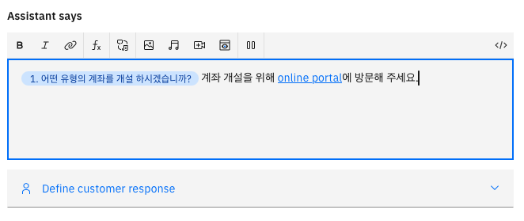     

   - **And then > End the action** 을 선택합니다.  
      옵션 상자에서 ```End the action```을 선택합니다.
      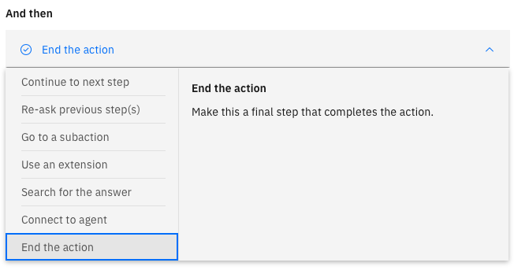    
      이 스텝의 최종 완료를 설정하였습니다.   
          

   - **Preview** 버튼을 클릭하여 동작을 확인 합니다.     
          
      네번째 스텝을 완료 하였습니다.    
